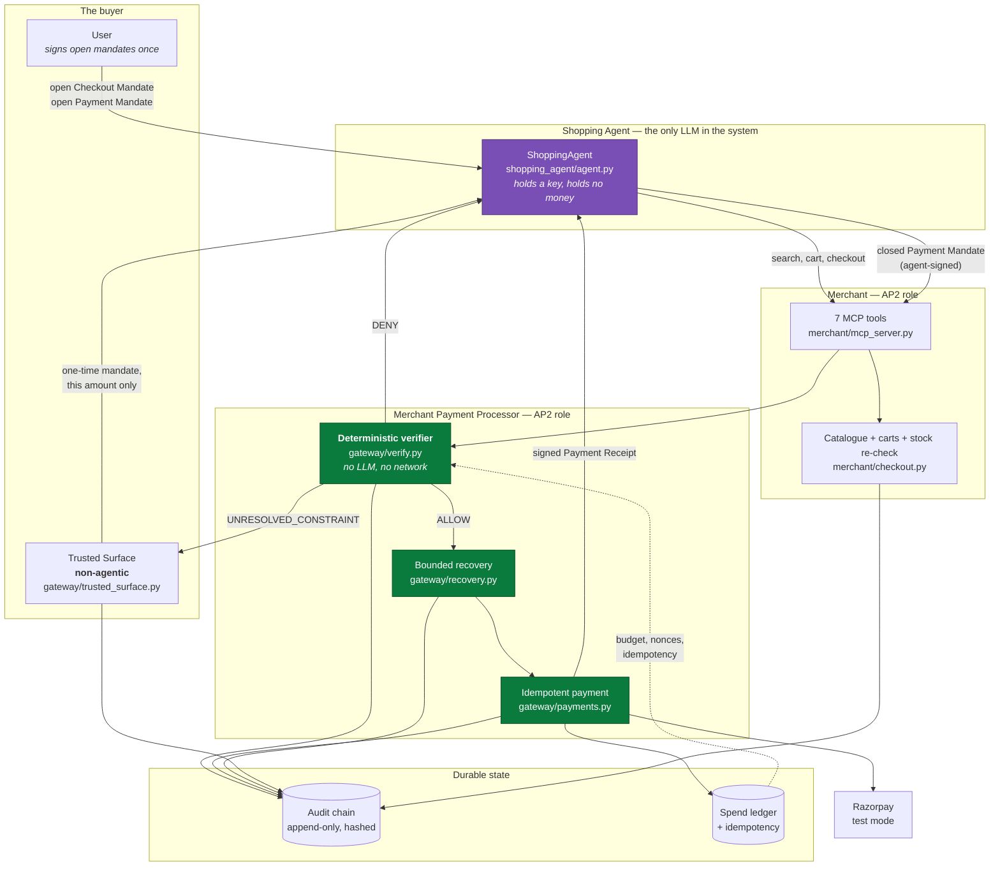

# ap2-razorpay-gateway

**An implementation of Google's Agent Payments Protocol (AP2 v0.2) for Razorpay.**

Implements the AP2 **Merchant** and **Merchant Payment Processor** roles so that any
AP2 shopping agent can buy from an Indian merchant — with cryptographically verifiable
mandates, deterministic verification, a human gate, bounded recovery, and a
tamper-evident audit trail.

```
6 attempts · 4 paid · 1 human-denied · 1 recovered · Rs 0 unauthorised · 6/6 explained
```

That line is printed by `make demo`. Every number in it is measured, not written —
see [DEMO.md](DEMO.md).

```bash
git clone https://github.com/PrinceTomar1/ap2-razorpay-gateway.git
cd ap2-razorpay-gateway && cp .env.example .env && make setup && make demo
```

---

## The problem

An AI agent that holds a payment credential is unbounded liability.

Not a hypothetical one. Give a shopping agent a card number and there is no
technical limit on what it can spend, where it can spend it, how many times it can
spend it, or what it does when a payment fails halfway through. The controls that
exist — "are you sure?", a spending cap in a dashboard, a support queue — are
controls on a *human* checkout flow. An agent hits them at machine speed, with no
human present, and nothing about the credential itself says "₹1,500, at these three
shops, once".

Google published AP2 in September 2025 with 60+ organisations behind it, including
Mastercard, Visa, PayPal and Coinbase, to fix precisely this: a purchase carries a
*mandate* — a signed, constrained, verifiable statement of what the buyer authorised
— and every party checks it in deterministic code before money moves.

There is no AP2 implementation for Razorpay or for UPI. Razorpay is building agentic
payments with NPCI and OpenAI. This is that missing piece, built to the spec.

## The claim, and how to check it

> Every money action explainable, bounded and gated. Show the audit trail and one
> failure handled gracefully.

| Claim | Where it lives | How to check it |
|---|---|---|
| **Explainable** | Every audit row carries one plain-English sentence; every `Decision` carries the checks it ran and the numbers they compared | `make demo` prints the whole trail; `test_every_audited_money_action_carries_a_human_reason` |
| **Bounded** | Five AP2 constraints in [`gateway/verify.py`](gateway/verify.py); a 3-attempt recovery cap in [`config/policy.yaml`](config/policy.yaml) | `tests/test_verify.py`, `tests/test_recovery.py` |
| **Gated** | [`gateway/trusted_surface.py`](gateway/trusted_surface.py) — non-agentic, and an approval authorises exactly one purchase | `tests/test_trusted_surface.py` |
| **Audit trail** | Append-only, hash-chained SQLite in [`gateway/audit.py`](gateway/audit.py) | `tests/test_audit_chain.py` breaks it four ways and catches each |
| **A failure handled gracefully** | Eight of them | `tests/test_failure_modes.py` |

## Run it in three commands

```bash
make setup     # venv + pinned deps + .env from .env.example
make test      # 516 tests, all offline
make demo      # the six-attempt batch, zero network
```

`make demo` needs no API key, no Razorpay account, and no internet. It runs against
an in-memory payment rail and prints the full audit trail.

Optional:

```bash
make lint             # ruff + mypy, both clean
make demo LIVE=1      # attempts 1 and 4 against the real Razorpay TEST sandbox
make mcp              # the Merchant MCP server on stdio
make serve            # Trusted Surface page + Razorpay webhook receiver
make smoke            # fresh-clone smoke test in a temp dir
```

## Architecture



Green: no language model may run here, enforced by a test. Purple: the only place one does.

## AP2 role mapping

AP2 v0.2 defines five roles. This repository implements two, simulates two, and is
honest about the fifth.

| AP2 role | Status | Where |
|---|---|---|
| **Merchant** | Implemented | `merchant/mcp_server.py`, `merchant/service.py`, `merchant/checkout.py` |
| **Merchant Payment Processor** | Implemented | `gateway/verify.py`, `gateway/payments.py`, `gateway/recovery.py`, `gateway/razorpay_client.py` |
| **Trusted Surface** | Implemented, non-agentic | `gateway/trusted_surface.py` |
| **Shopping Agent** | Simulated, so there is something to verify against | `shopping_agent/agent.py` |
| **Credential Provider** | **Not implemented** — see [LIMITATIONS.md](LIMITATIONS.md) | — |

Mandates use the spec's exact `vct` claims — `mandate.checkout.open.1`,
`mandate.checkout.1`, `mandate.payment.open.1`, `mandate.payment.1` — matched byte
for byte, because the spec says implementations MUST. Five Payment Mandate
constraint types are implemented with the spec's own evaluation algorithms quoted in
each docstring: `payment.budget`, `payment.amount_range`, `payment.allowed_payees`,
`payment.execution_date`, `payment.reference`.

## The safety model

**The agent can shop. It cannot pay.**

It holds one ES256 keypair. The buyer signed two open mandates naming that key: a
Checkout Mandate (which merchants, what ceiling, which pincode) and a Payment
Mandate (₹5,000/day, ₹1,500/purchase, three merchants, 24 hours). Every purchase is
a *closed* mandate the agent signs under those, and every closed mandate is checked
in `gateway/verify.py` before a rupee moves.

Fourteen checks run on a clean purchase. Signature. Exact `vct`. Presenter role. Not
expired — both mandates. RFC 7800 key binding, so a leaked standing authorisation is
not bearer authority. Currency. Payee on the allow-list. Amount in range. Running
spend plus this amount within budget. Execution window. Bound to *this* checkout by
hash. Nonce not seen before.

Three outcomes, and the distinction between the last two is the design:

- **ALLOW** — every check passed; funds may move, once.
- **DENY** — a bound was *violated*. The agent presented a well-formed closed mandate
  asking for something it was not authorised to do. There is no path forward, and the
  answer is a reason object, not an exception.
- **UNRESOLVED_CONSTRAINT** — the agent presented its *standing* authorisation and
  admitted it is not enough. That is AP2's own error shape, and it routes to the
  Trusted Surface. An agent that asks gets a human. An agent that forces gets refused.

**Approval is not an unlock.** Saying yes at the Trusted Surface mints the narrowest
mandate that can possibly fund that one purchase: `amount_range` with `min == max`,
a `budget` equal to that same amount so it can fund one payment and never a second,
one merchant, `payment.reference` pinned to that specific checkout's hash, and a
ten-minute expiry. The buyer's ₹1,500 standing cap is exactly where it was.

**No language model on the money path.** Not a policy — a test:

```bash
grep -rn "anthropic\|llm\." gateway/verify.py gateway/payments.py gateway/recovery.py
```

returns nothing, and `tests/test_failure_modes.py` fails the build if that ever
changes. Reasoning about why, in [ARCHITECTURE.md](ARCHITECTURE.md#where-we-deliberately-do-not-use-an-llm).

## The eight failure modes

Each is implemented, and each has a test asserting **both** the outcome and the
corresponding audit row.

| # | Failure | What happens | Where |
|---|---|---|---|
| 1 | **Bank decline** | Instrument ladder: UPI → payment link → card, capped at 3 attempts, then a signed `payment_failed` receipt | `gateway/recovery.py` |
| 2 | **API drop / timeout** | Circuit breaker trips on *transport* failures only. The payment is **deferred with no receipt**, so the mandate stays unspent and works on the next tick | `gateway/recovery.py` |
| 3 | **Invalid mandate** | Typed rejection at the boundary — malformed, forged, `alg:none`, HMAC/EC confusion, unknown key, wrong role. Nothing reaches Razorpay | `gateway/mandates.py` |
| 4 | **Budget breach** | `DENY` with a reason object carrying the arithmetic: `already_spent`, `requested`, `budget`, `over_by` | `gateway/verify.py` |
| 5 | **Stock race** | Stock and price re-read live before the verifier *and* before every recovery retry. Clean decline, nothing charged | `merchant/checkout.py` |
| 6 | **Duplicate submit** | `sha256(payment_mandate.id)` idempotency, a capture probe over every prior order, and a DB-backed attempt lease for simultaneous submits | `gateway/payments.py` |
| 7 | **Hallucinated SKU** | `check_product` → flat `product.not_found`. No cart, no signature, the verifier never runs, the agent re-plans | `merchant/service.py` |
| 8 | **Out-of-band request** | `unresolved_constraint` → Trusted Surface → the human signs a one-time mandate, or declines | `gateway/trusted_surface.py` |

A ninth, added during adversarial review: a **non-retryable** decline. A rejected
*request* — bad amount, order already paid, suspended account — cannot be fixed by
a different instrument, so recovery stops after one attempt instead of failing
identically twice more and creating two orders for nothing.

The nastiest case is worth naming on its own: **a timeout whose payment actually
succeeded.** Before creating any new order, the processor asks the rail about every
order already created under the same idempotency key. If one captured, it stops and
returns that capture. `test_failure_2_a_timeout_that_actually_captured_is_not_charged_twice`.

## Repository map

```
ap2_min/        vendored AP2 v0.2 models — mandates, typed constraints, receipts, roles
gateway/        verify · payments · recovery · audit · trusted_surface
                razorpay_client · webhooks · ledger · policy · config · db
                bootstrap (composition root) · app (FastAPI)
merchant/       catalogue, carts, stock re-check, service, the 7-tool MCP server
llm/            the only door a model gets: narration + product selection
shopping_agent/ the agent, its MCP client, and the human gate it cannot cross
demo/           the six-attempt batch and its measured report
tests/          18 files, 516 tests; every failure mode asserts an outcome
                AND the audit row that records it
```

## Documentation

- [ARCHITECTURE.md](ARCHITECTURE.md) — roles, the full request lifecycle, the trust
  model, and *where we deliberately do not use an LLM*
- [SECURITY.md](SECURITY.md) — ten threats, each mitigation, and the test that
  proves it; plus what is deliberately **not** defended
- [VERIFICATION_REPORT.md](VERIFICATION_REPORT.md) — the adversarial review pass,
  with pasted output for every check
- [DEMO.md](DEMO.md) — what the batch proves, and why the numbers are real
- [LIMITATIONS.md](LIMITATIONS.md) — what this is not, stated plainly
- [DECISIONS.md](DECISIONS.md) — every autonomous choice and its one-line rationale
- [docs/RAZORPAY_TESTING.md](docs/RAZORPAY_TESTING.md) — the live sandbox check
- [VIDEO_SCRIPT.md](VIDEO_SCRIPT.md), [BUILD_REPORT.md](BUILD_REPORT.md)

## What's next

- **SD-JWT.** AP2 specifies selective disclosure; we sign whole mandates as compact
  JWS. That is a privacy gap, not an integrity one, and closing it is a change to
  `gateway/mandates.py` and the signature checks in `gateway/verify.py` — nothing else.
- **Real UPI Reserve Pay** when NPCI's pilot opens. The mandate model already
  expresses a reserve-then-capture flow; only `gateway/razorpay_client.py` changes.
- **Multi-merchant routing** — one basket, several payees, several Payment Mandates.
- **Credential Provider**, so the buyer's instrument is held by a party that is
  neither the agent nor the merchant.
- **An external anchor for the audit chain.** Publishing the tip hash would close the
  one tamper a self-contained chain cannot catch: truncation from the end.

## Safety and compliance

Test mode only. `PAYMENT_RAIL=fake` is the default, and `RazorpayRail` refuses in
code to construct with a key id that is not `rzp_test_`. No live keys, no real money,
no secrets in the repository, no scraping, no personal data. The catalogue is
synthetic: three fictional merchants, sixty invented SKUs, plausible prices, no real
product or business represented.

The threat model is in [SECURITY.md](SECURITY.md), including a section on what is
deliberately not defended — this is a buildathon submission, not a deployed
service.

## Credits and licence

MIT — see [LICENSE](LICENSE).

- **Agent Payments Protocol (AP2)** — Google, Apache-2.0,
  [github.com/google-agentic-commerce/AP2](https://github.com/google-agentic-commerce/AP2).
  Specification text quoted in this repository's docstrings and documentation remains
  under that licence. `ap2_min/` is a vendored transcription of the subset used here;
  the reasoning is in [DECISIONS.md](DECISIONS.md).
- **Razorpay** — the Orders, Payment Links, Payments and Webhooks APIs, implemented
  from the official documentation and the official Python SDK.
- **W3C Payment Request API** — the shape AP2 borrows for amounts and carts.
